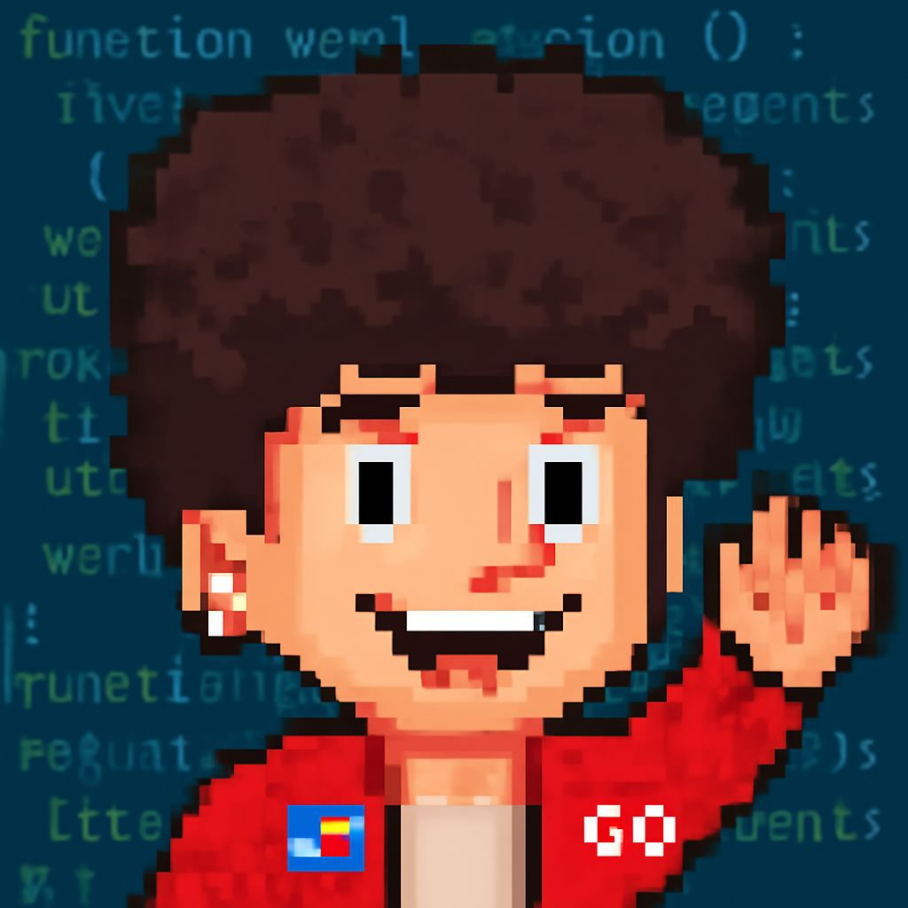

<table>
  <tr>
    <td width="60%">
      <h2>Hi there 👋 I'm Farhad Ranjbar</h2>
      

        A passionate Android and full-stack developer with over 6 years of experience in mobile and backend development. 
        Currently working as an Android Developer at <strong>Aryamanesh (Legaro)</strong>. 
        Previously worked at <strong>Daneshjooyar</strong> as an Android Developer and Instructor. 
        Skilled in Kotlin, Flutter, Golang, Rust, Python, and more. I love learning, solving complex problems, and working with Linux systems. 
        Beyond coding, I enjoy playing the violin and skating to keep my mind fresh and motivated. 🎻🛹
      

    </td>
    <td>
      
    </td>
  </tr>
</table>

---

### 🚀 About Me

- 🧠 Started programming at age 12
- 📱 Android Developer @ Aryamanesh (Legaro)
- 👨‍🏫 Former Android Developer & Instructor @ Daneshjooyar
- 💼 Founder of **FamaStudio** & **GriffinStudio**
- 🏆 Multiple national and provincial awards (Khwarizmi, Omid-e-Farda)
- 📍 Based in Birjand, Iran
- 🖥️ Linux enthusiast

---

### 🛠 Tech Stack

---

### 🧱 Architectures

I’ve worked with multiple architectures in mobile and backend software development:

- 🧩 MVVM (Model-View-ViewModel)
- 🔄 MVI (Model-View-Intent)
- 🧠 MVP (Model-View-Presenter)
- 📦 NIA (Now in Android architecture by Google)
- 🧱 Hexagonal (Ports & Adapters)
- 🏗️ Multi-layered (Data, Domain, Presentation)
- ✨ ...and custom hybrid solutions

---

### 🌟 Featured Projects

#### 🧪 Open Source Projects
- [☁️ Weather App](https://github.com/barbossa-dev/weather)
- [📅 Jetpack Compose Date Picker](https://github.com/alirezaahmadi056/date-picker)
- [🎯 Compose Scroll Picker](https://github.com/barbossa-dev/ComposeScrollPicker)
- [🍽️ AR Restaurant Menu](https://github.com/barbossa-dev/GriffinRestaurant)

#### 🔒 Commercial Projects (Source Code Not Available)
- 🧠 **Amozeshgam** — educational mobile app
- 🌐 **Bilingual** — language learning application
- 🏠 **Legaro** — smart home automation platform
- 🧩 ...and other internal systems & client projects

---

### 📈 GitHub Stats

---

### 📫 Contact Me

  
  
  

---

### 🏅 Achievements

- 🥇 1st Place, National Khwarizmi Youth Festival
- 🥇 1st Place, National Omid-e-Farda Festival
- 🥇 Top Place, Provincial Youth Competitions

---

> ✨ *Thanks for visiting! Let’s build something great together.*
